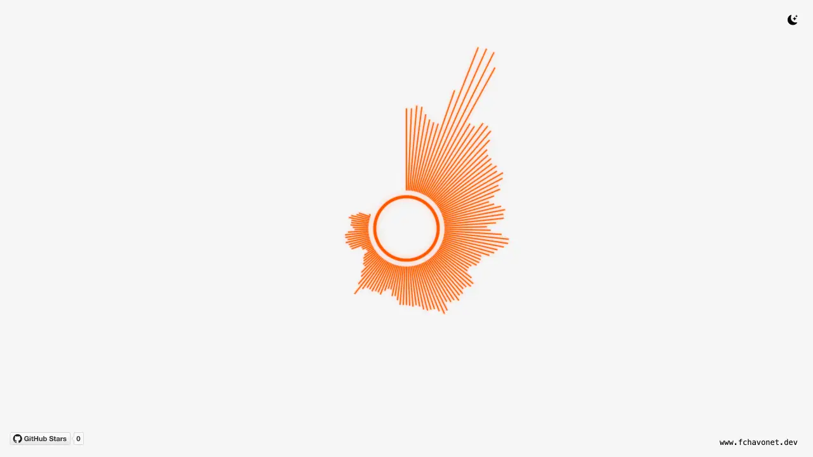

# Audio Visualizer

## Description

This project is an interactive web-based audio visualizer built with the Web Audio API and Canvas.

It captures real-time audio from your microphone and displays a circular animation that reacts dynamically to sound frequencies.

## Objectives

- Capture and analyze real-time audio from the microphone.
- Render a circular bar-style visualizer using the Canvas API.
- Strengthen JavaScript skills in audio processing and animation.

## Tech Stack


## File Description

| **FILE**     | **DESCRIPTION**                                             |
| :----------: | ----------------------------------------------------------- |
| `assets`     | Contains the resources required for the repository.         |
| `index.html` | HTML structure of the project.                              |
| `style.css`  | CSS styles and theme for the visualizer.                    |
| `script.js`  | JavaScript logic for audio processing and visual rendering. |
| `README.md`  | The README file you are currently reading 😉.               |

## Installation & Usage

### Installation

1. Clone this repository:
    - Open your preferred Terminal.
    - Navigate to the directory where you want to clone the repository.
    - Run the following command:

```
git clone https://github.com/fchavonet/creative_coding-audio_visualizer.git
```

2. Open the cloned repository.

### Usage

1. Open the `index.html` file in your web browser.

2. Allow microphone access when prompted.

3. Speak or play audio through your device. The circular bars will react to the sound in real-time.

You can also test the project online by clicking [here](https://fchavonet.github.io/creative_coding-audio_visualizer/). 

<p align="center">
    <picture>
        <source media="(prefers-color-scheme: dark)" srcset="./assets/images/screenshots/desktop_page_screenshot-dark.webp">
        <source media="(prefers-color-scheme: light)" srcset="./assets/images/screenshots/desktop_page_screenshot-light.webp">
        
    </picture>
</p>

## What's Next?

- Add support for selecting local audio files as an alternative to the microphone input.
- Add visual customizations (bar shape, glow intensity, color themes).
- Export screenshots or short video clips of the visualization.

## Thanks

- Thanks to the open-source community for documentation and inspiration.

## Author(s)

**Fabien CHAVONET**
- GitHub: [@fchavonet](https://github.com/fchavonet)
